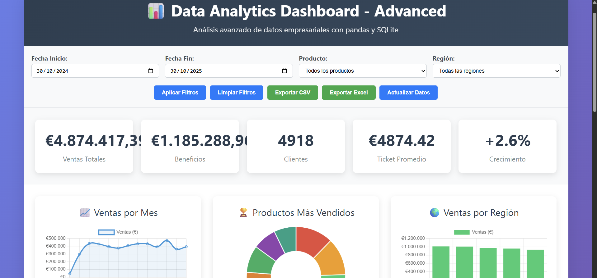
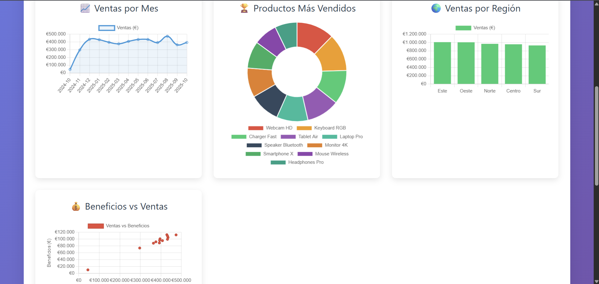
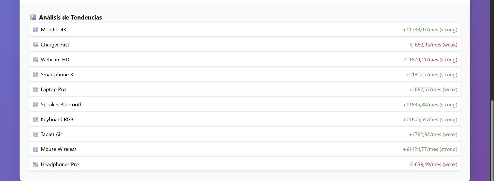
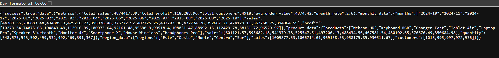
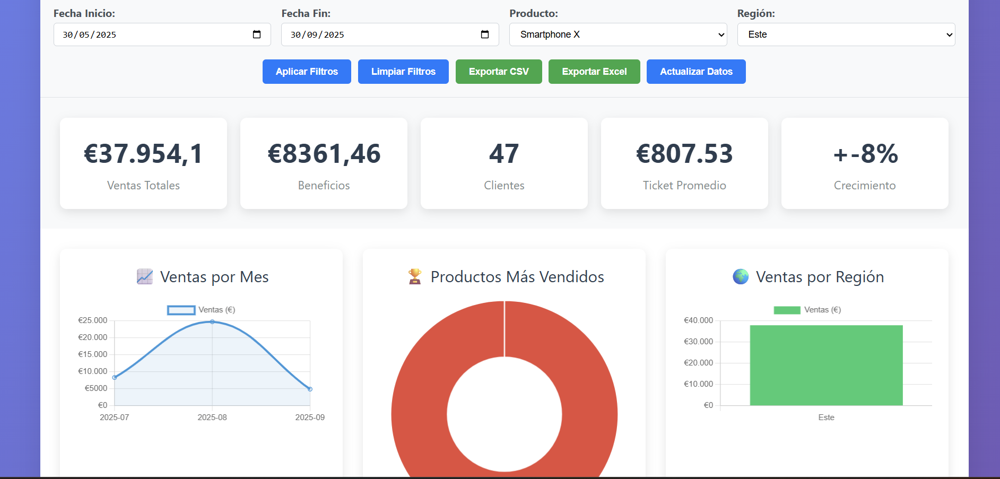

# 📊 Data Analytics Dashboard - Advanced

[](../../actions/workflows/python-ci.yml)
[](LICENSE)
[](https://python.org)
[](https://fastapi.tiangolo.com)
[](https://pandas.pydata.org)
[](https://sqlite.org)
[](https://docker.com)

## 🎯 **Descripción**

Sistema avanzado de análisis de datos empresariales desarrollado con Python, FastAPI, Pandas y SQLite. Incluye dashboard interactivo, filtros dinámicos, exportación de datos, análisis de tendencias y APIs REST documentadas.

## ✨ **Características Principales**

### **📊 Dashboard Interactivo**
- **Métricas KPI** en tiempo real (Ventas, Beneficios, Clientes, Crecimiento)
- **4 gráficos interactivos** (Líneas, Dona, Barras, Dispersión)
- **Filtros dinámicos** por fecha, producto y región
- **Diseño responsive** y moderno

### **🔧 Backend Avanzado**
- **FastAPI** - Framework web moderno y rápido
- **Pandas + NumPy** - Procesamiento de datos real
- **SQLite** - Base de datos persistente con 1000+ registros
- **APIs REST** - 10+ endpoints documentados
- **Análisis de tendencias** con regresión lineal

### **📤 Exportación de Datos**
- **CSV** - Exportación de datos filtrados
- **Excel** - Múltiples hojas con resumen
- **Filtros aplicados** - Exporta solo datos seleccionados

### **🧪 Testing y Calidad**
- **Tests unitarios** - 15+ tests automatizados
- **Docker** - Containerización completa
- **Health checks** - Monitoreo del sistema

## 🛠️ **Stack Tecnológico**

### **Backend**
- **Python 3.11+** - Lenguaje principal
- **FastAPI 0.104.1** - Framework web
- **Pandas 2.1.4** - Manipulación de datos
- **NumPy 1.24.4** - Computación numérica
- **SQLite3** - Base de datos embebida
- **OpenPyXL 3.1.2** - Exportación Excel

### **Frontend**
- **HTML5 + CSS3** - Estructura y estilos
- **JavaScript ES6+** - Interactividad
- **Chart.js** - Visualizaciones
- **Responsive Design** - Mobile-first

### **DevOps**
- **Docker** - Containerización
- **Docker Compose** - Orquestación
- **pytest** - Testing framework

## 👀 **Preview**











## 🚀 **Instalación y Uso**

### **Opción 1: Desarrollo Local**
```bash
# 1. Clonar repositorio
git clone https://github.com/josevicenteprojects/DataAnalytics_Dashboard.git
cd DataAnalytics_Dashboard

# 2. Instalar dependencias
pip install -r requirements.txt

# 3. Ejecutar aplicación
python app_advanced.py

# 4. Acceder al dashboard
# http://localhost:8002
```

### **Opción 2: Con Docker (Quickstart)**
```bash
# 1. Construir y ejecutar
docker-compose up --build

# 2. Acceder al dashboard
# http://localhost:8002
```

### **Opción 3: Script de Inicio**
```bash
# Windows
start_advanced.bat

# Linux/Mac
python run_advanced.py --mode dev
```

## 📊 **APIs Disponibles**

### **Datos y Métricas**
- `GET /` - Dashboard principal
- `GET /api/data` - Todos los datos de análisis
- `GET /api/sales` - Datos de ventas con filtros
- `GET /api/products` - Productos más vendidos
- `GET /api/regions` - Ventas por región
- `GET /api/metrics` - Métricas generales
- `GET /api/filters` - Opciones de filtros
- `GET /api/trends` - Análisis de tendencias

### **Exportación**
- `GET /api/export/csv/sales` - Exportar CSV de ventas
- `GET /api/export/excel` - Exportar Excel completo

### **Sistema**
- `GET /health` - Health check
- `GET /docs` - Documentación Swagger

## 🧪 **Testing**

```bash
# Ejecutar tests unitarios
python test_app.py

# O con pytest
pytest test_app.py -v

# Tests incluidos:
# - DatabaseManager (5 tests)
# - API Endpoints (8 tests)
# - Data Processing (2 tests)
```

## 🐳 **Docker**

```bash
# Construir imagen
docker build -t data-analytics-dashboard .

# Ejecutar contenedor
docker run -p 8002:8002 data-analytics-dashboard

# Docker Compose
docker-compose up --build
```

## 📁 **Estructura del Proyecto**

```
DataAnalytics_Dashboard/
├── app_advanced.py          # Backend FastAPI principal
├── database.py              # Gestión de base de datos
├── test_app.py              # Tests unitarios
├── run_advanced.py          # Script de inicio avanzado
├── requirements.txt         # Dependencias Python
├── Dockerfile              # Containerización
├── docker-compose.yml      # Orquestación
├── start_advanced.bat      # Script Windows
├── README.md               # Documentación principal
├── .gitignore              # Archivos a ignorar
└── static/
    └── dashboard_advanced.html  # Frontend avanzado
```

## 🎯 **Casos de Uso**

Este sistema puede utilizarse en diversos contextos empresariales para análisis de datos y toma de decisiones:

### **Análisis de Ventas y Performance**
- Visualización de métricas de ventas en tiempo real
- Identificación de tendencias y patrones de comportamiento
- Análisis comparativo por productos y regiones
- Generación de reportes ejecutivos para stakeholders

### **Business Intelligence**
- Dashboard ejecutivo con KPIs principales
- Exportación de datos para análisis externos
- Filtrado avanzado para segmentación de datos
- Análisis predictivo mediante regresión lineal

### **Reporting y Exportación**
- Generación automática de reportes en CSV y Excel
- Filtrado personalizado de datos antes de exportar
- Múltiples formatos de salida para diferentes necesidades
- Documentación automática de APIs para integración

## 🔧 **Arquitectura y Decisiones Técnicas**

### **Backend**
- **FastAPI**: Framework elegido por su alto rendimiento y documentación automática
- **SQLite**: Base de datos ligera ideal para prototipos y proyectos medianos
- **Pandas**: Librería estándar para manipulación y análisis de datos en Python
- **REST API**: Arquitectura RESTful para facilitar la integración con otros sistemas

### **Frontend**
- **Vanilla JavaScript**: Sin dependencias de frameworks pesados, código ligero y rápido
- **Chart.js**: Librería de visualización probada y confiable
- **Responsive Design**: Mobile-first para accesibilidad en todos los dispositivos

### **DevOps**
- **Docker**: Containerización para despliegue consistente en cualquier entorno
- **CI/CD**: Automatización de tests y despliegue mediante GitHub Actions
- **Testing**: Suite de tests unitarios para garantizar calidad del código


## 📄 **Licencia**

Este proyecto está bajo la Licencia MIT. Ver el archivo [LICENSE](LICENSE) para más detalles.

## 👨‍💻 **Autor**

**Jose Vicente** - Desarrollador Full-Stack y Data Scientist

- **GitHub:** [@josevicenteprojects](https://github.com/josevicenteprojects)
- **LinkedIn:** [Jose Vicente Alonso Betancourt](https://www.linkedin.com/in/jose-vicente-alonso-betancourt-65207a234/)
- **Email:** jvab5899@gmail.com

## 🤝 **Contribuciones**

Las contribuciones son bienvenidas. Por favor:

1. Fork el proyecto
2. Crea una rama para tu feature (`git checkout -b feature/AmazingFeature`)
3. Commit tus cambios (`git commit -m 'Add some AmazingFeature'`)
4. Push a la rama (`git push origin feature/AmazingFeature`)
5. Abre un Pull Request

## 📞 **Soporte**

Si tienes preguntas o necesitas ayuda:

- **Issues:** [GitHub Issues](https://github.com/josevicenteprojects/DataAnalytics_Dashboard/issues)
- **Discusiones:** [GitHub Discussions](https://github.com/josevicenteprojects/DataAnalytics_Dashboard/discussions)
- **Email:** jvab5899@gmail.com


